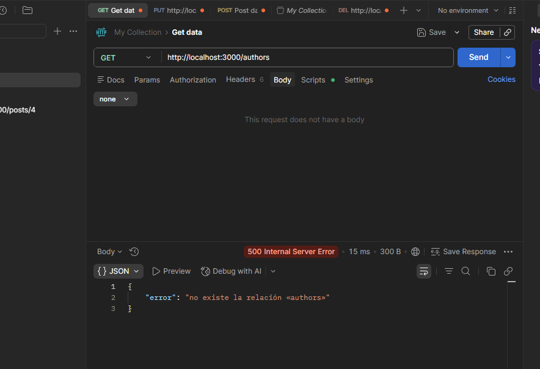
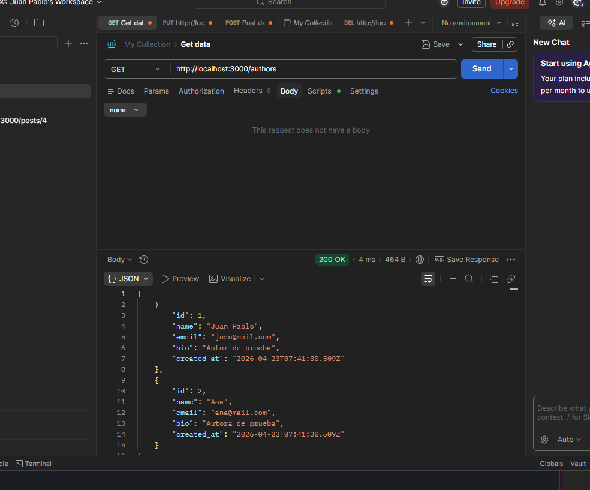
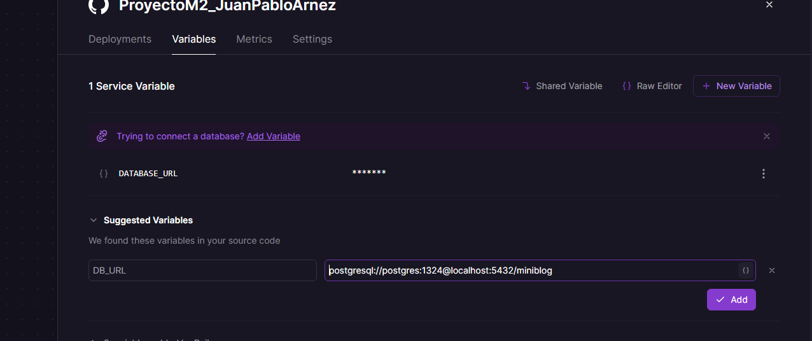
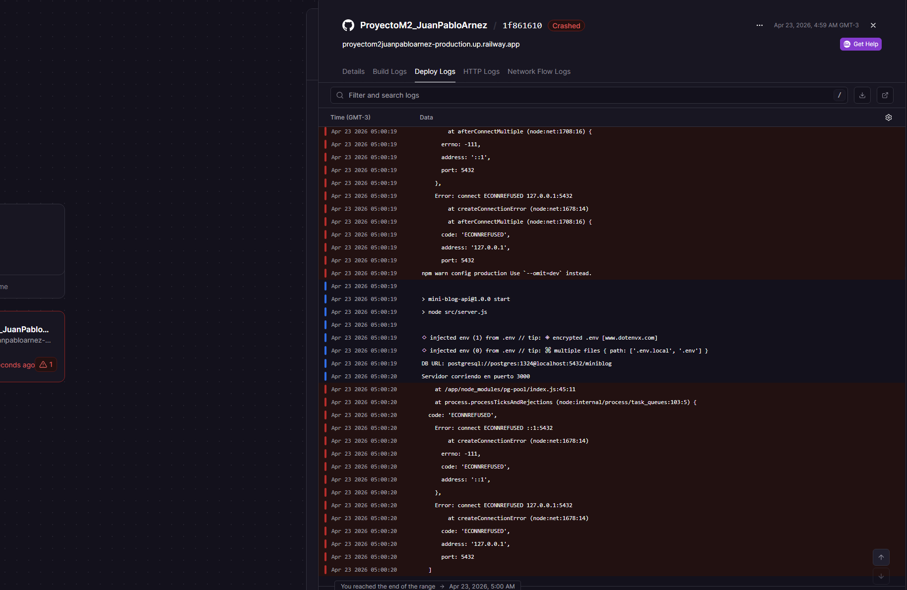
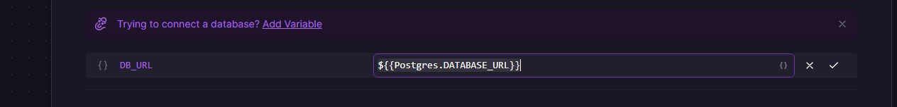
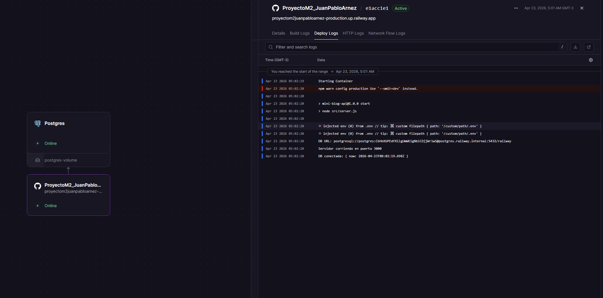
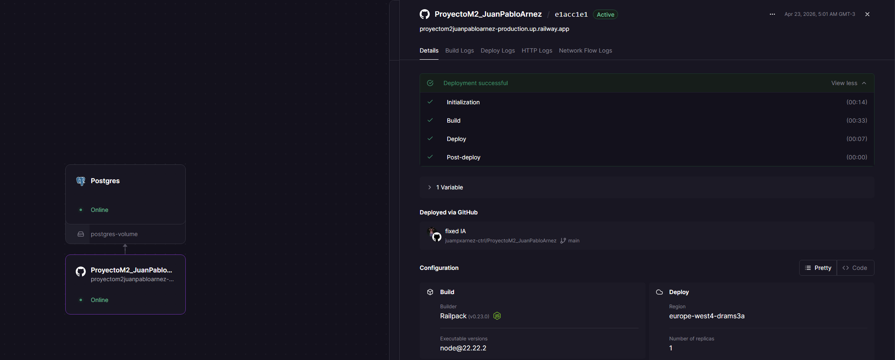
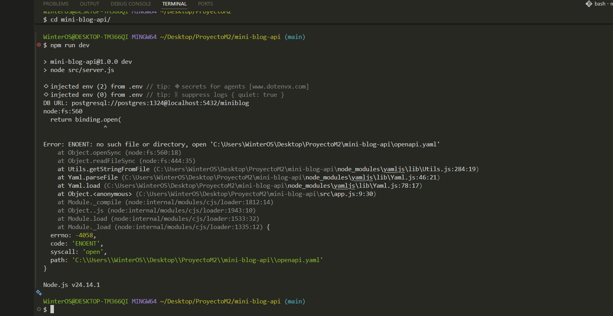
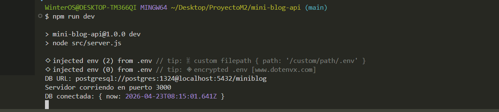

# -Documentación del uso de Inteligencia Artificial

Durante el desarrollo del proyecto MiniBlog API se utilizó inteligencia artificial como herramienta de apoyo para resolver dudas, depurar errores y mejorar la calidad del código.

El uso de IA fue complementario al aprendizaje, permitiendo aplicar de forma práctica los contenidos vistos en las lectures.

---

## -Problemas donde se utilizo IA:

## 🔴 Problema 1: Error con Jest al usar ES Modules

Se presentó el siguiente error al ejecutar los tests:


Se intentó utilizar sintaxis ES Modules (`import`) en el archivo de test:

```js
import request from 'supertest';
import app from '../src/server';
```

Al ejecutar los test con:

npm test

se obtuvo el siguiente error:


SyntaxError: Cannot use import statement outside a module

Esto ocurrió debido a una incompatibilidad entre ES Modules y la configuración de Jest.
La solución fue adaptar el proyecto a CommonJS.


## 🔴 Problema 2: Base de datos sin tablas

Al consultar la API se obtuvo el siguiente error:


Esto ocurrió porque las tablas `authors` y `posts` no existían en PostgreSQL.

Este error fue mio al precipitarme y hacer todo de corrido sin tener en cuenta que para probar en postman debia crear tablas, por ende recurri a mis archivos seed.sql y setup.sql con el comando psql

```
-U postgres -d miniblog -f sql/setup.sql
-U postgres -d miniblog -f sql/seed.sql
```
Teniendo como exito:



Luego de restaurar la base de datos, la API volvió a responder correctamente.

## 🔴 Problema 3: Error de conexión a la base en Railway

Durante el deploy en Railway se presentó un error de conexión a PostgreSQL debido a una mala configuración de la variable de entorno `DB_URL`.

En los logs del servicio apareció un error similar a:


Causa del problema:
La variable DB_URL estaba mal configurada, apuntando a un host inválido.

Solución:
Se logro corregir la variable en Railway utilizando la referencia provista por el servicio PostgreSQL:





Luego de corregir la variable, la aplicación pudo conectarse correctamente a la base de datos y el deploy quedó funcionando.

## 🔴 Problema 4: Error en Swagger (archivo OpenAPI no encontrado)

Durante la ejecución del proyecto se presentó un error al intentar cargar la documentación Swagger.

En la consola se obtuvo el siguiente mensaje:

```bash
Error: ENOENT: no such file or directory, open 'openapi.yaml'
```
En la web:


Causa principal del problema:

El archivo openapi.yaml no se encontraba en la ubicación esperada o estaba mal nombrado, swagger depende de este archivo para generar la documentación, por lo que su ausencia provoca un fallo en la carga.

Solucion que se llevo acabo, se consulto a la ia el problema textual de porque no reconocia el archivo OpenApi, devolucion que recibi fue que el nombre no era el correcto, por ende no lo reconocia y tampoco se reflejaba en la web.

Se corriogio el nombro y el resultado fue:



---


