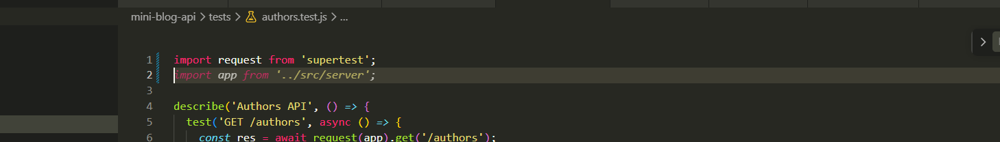
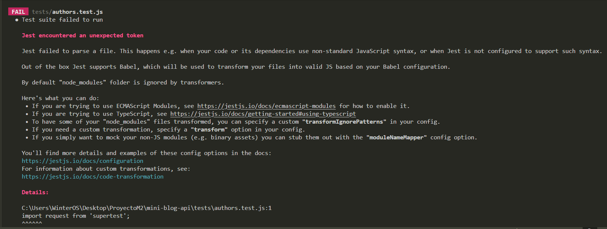
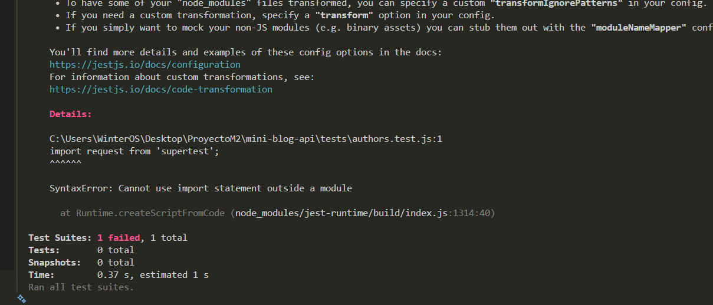
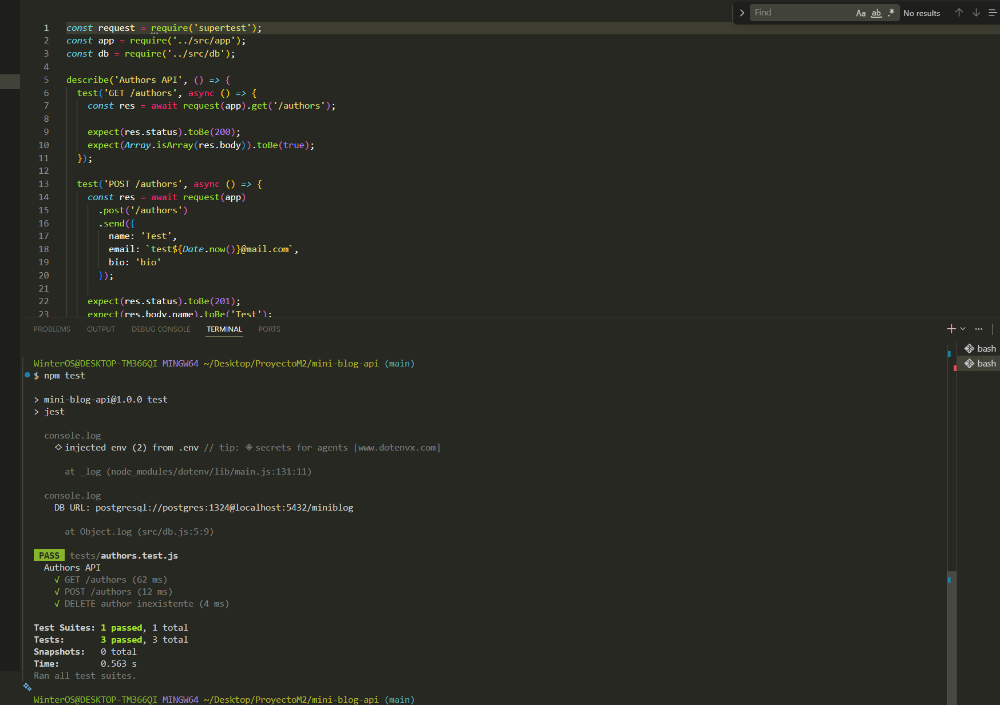

# -Documentación del uso de Inteligencia Artificial

Durante el desarrollo del proyecto MiniBlog API se utilizó inteligencia artificial como herramienta de apoyo para resolver dudas, depurar errores y mejorar la calidad del código.

El uso de IA fue complementario al aprendizaje, permitiendo aplicar de forma práctica los contenidos vistos en las lectures.

---

## -Problemas donde se utilizo IA:

## 🔴 Problema 1: Error con Jest al usar ES Modules

Se presentó el siguiente error al ejecutar los tests:



Se intentó utilizar sintaxis ES Modules (`import`) en el archivo de test:
```js
import request from 'supertest';
import app from '../src/server';
```
Al ejecutar los test con:

npm test

se obtuvo el siguiente error:




SyntaxError: Cannot use import statement outside a module

Esto ocurrió debido a una incompatibilidad entre ES Modules y la configuración de Jest.
La solución fue adaptar el proyecto a CommonJS.



## 🔴 Problema 2: Base de datos sin tablas

Al consultar la API se obtuvo el siguiente error:
[error-db](./docs/output-db-error.png)

Esto ocurrió porque las tablas `authors` y `posts` no existían en PostgreSQL.

Este error fue mio al precipitarme y hacer todo de corrido sin tener en cuenta que para probar en postman debia crear tablas, por ende recurri a mis archivos seed.sql y setup.sql con el comando psql

```-U postgres -d miniblog -f sql/setup.sql
-U postgres -d miniblog -f sql/seed.sql
```
Teniendo como exito:

[input](./docs/input-fixed.png)

Luego de restaurar la base de datos, la API volvió a responder correctamente.

---


